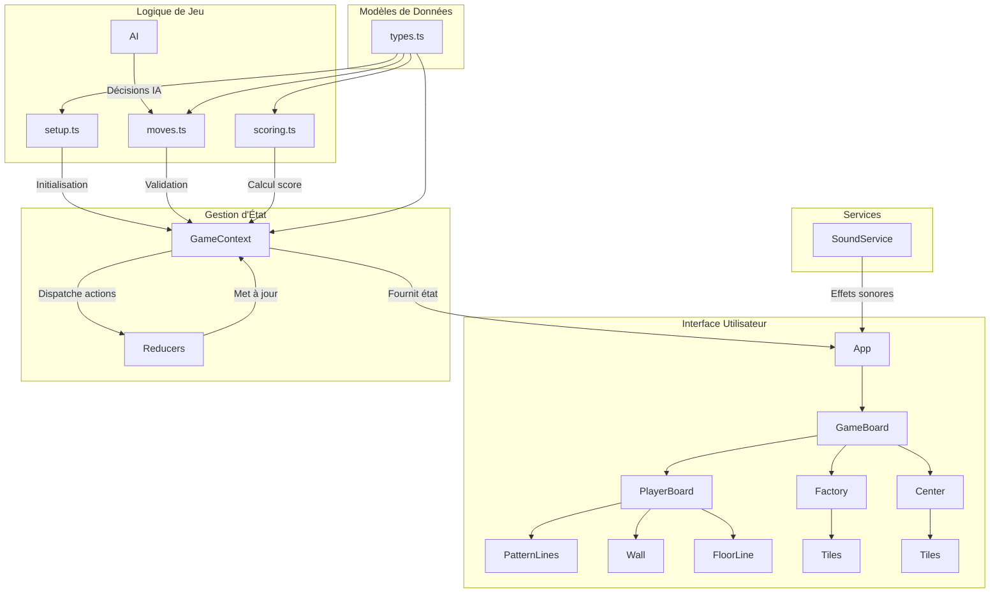

```mermaid
graph TD
    subgraph "Interface Utilisateur"
        A[App] --> B[GameBoard]
        B --> C1[PlayerBoard]
        B --> C2[Factory]
        B --> C3[Center]
        C1 --> D1[PatternLines]
        C1 --> D2[Wall]
        C1 --> D3[FloorLine]
        C2 --> D4[Tiles]
        C3 --> D5[Tiles]
    end

    subgraph "Gestion d'État"
        E[GameContext] --> |Fournit état| A
        E --> |Dispatche actions| F[Reducers]
        F --> |Met à jour| E
    end

    subgraph "Logique de Jeu"
        G1[setup.ts] --> |Initialisation| E
        G2[moves.ts] --> |Validation| E
        G3[scoring.ts] --> |Calcul score| E
        G4[AI] --> |Décisions IA| G2
    end

    subgraph "Services"
        H1[SoundService] --> |Effets sonores| A
    end

    subgraph "Modèles de Données"
        I[types.ts] --> G1
        I --> G2
        I --> G3
        I --> E
    end
```